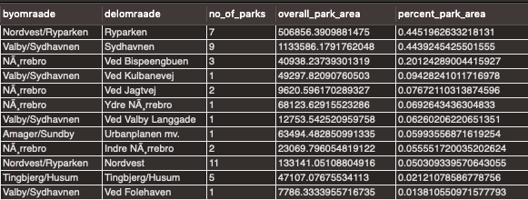
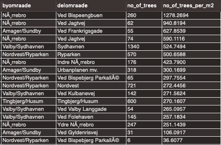
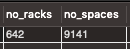

# DB10-Spatial Data
Database Assignment 10 regarding SpatialData and Geo

Assignment: https://github.com/datsoftlyngby/soft2019spring-databases/blob/master/assignments/assignment10.md

Slides: https://github.com/datsoftlyngby/soft2019spring-databases/blob/master/lecture_notes/10_Spatial_data.ipynb

------

## Exercise 1

Copenhagen has a strategy for improving the living conditions in socially exposed areas (udsatte områder). It a policy which both addresses the social aspects for the people living there, and the physical conditions.

This exercises addresses the physical conditions, through the following two questions:

- How many parks are located in exposed areas?
- How many trees are located in exposed areas?

The Copenhagen data is in Danish, so here is a brief word/search list:

- exposed areas (udsatte byomraader)
- trees along roads (gadetræer/gadetraer)
- parks (parkregister)

------

## Exercise 2

Copenhagen prides itself for its lively bike culture. There are a number of different data on bike and bike services. But in particular, bikes do not mix well with trucks.

- How many bike racks are places along routes for heavy traffic?

Again, to help navigate the danish table names:

- bike rack (cykelstativ)
- heavy traffic (tungvogn)


-----

## Setup

### Docker Container

Create a new Docker container

`sudo docker run --rm --name my_mysql -p 3306:3306 -e MYSQL_ROOT_PASSWORD=pass1234 -d mysql`

Enter the docker container

`sudo docker exec -it my_mysql bash`

Update the Docker Container

`apt-get update`

Install wget to download the `.sql`-files

`apt-get install wget -y`

### Import Database

Download the entire .sql-file [here](https://raw.githubusercontent.com/radeonxray/DB10-SpatialData/master/Dump20190407.sql)


Open MysqlWorkbench, connect to the docker container, the import the provided .sql by:

`Server -> Data Import`

- Select `Import from Self-contained file` 
- Locate the downloaded .sql-file
- Create a new schema for the DB to be imported into (I've named it db10)
- Go to `Import Progress` 
- Press the `Start Import`-button to begin the process

The process might take a couple of minutes, but if you've done everything correctly, you should now have a schema with the imported database, tables, data and all.


-----

## Answer Ex 1

**How many parks are located in exposed areas?**

```mysql
with parkregister_extended as (select *, ST_Area(wkb_geometry) as realm2 from parkregister)

select byomraade, delomraade,
       count(parkregister_extended.areal_id)  as "number_of_parks",
       sum(parkregister_extended.realm2)      as "overall_park_area",
       sum(parkregister_extended.realm2) / m2 as "percent_park_area"
from udsatte_byomraader,
     parkregister_extended
where ST_Within(parkregister_extended.wkb_geometry, udsatte_byomraader.wkb_geometry)
group by udsatte_byomraader.id
order by percent_park_area desc;
```
**Results**



**How many trees are located in exposed areas?**

```mysql
select byomraade, delomraade,
count(gadetraer.id)  as "number_of_trees",
count(gadetraer.id) / (m2 / 1000000) as "number_of_trees_per_m2"
from udsatte_byomraader, gadetraer
where st_within(gadetraer.wkb_geometry, udsatte_byomraader.wkb_geometry)
group by udsatte_byomraader.id
order by number_of_trees_per_m2 desc;
```

**Results**


------

## Answer Ex 2

**How many bike racks are places along routes for heavy traffic?**

```mysql
with heavy_roads as (select ST_GeomFromText(ST_ASTEXT(ST_Buffer(ST_GeomFromText(ST_AsText(wkb_geometry), 0), 0.00025)), 4326) as area, id, vej from tungvognsnet)
select count(*) as "number_racks", sum(cykelstativ.antal_pladser) as "number_spaces"
from heavy_roads, cykelstativ
where st_within(cykelstativ.wkb_geometry, heavy_roads.area);
```

**Results**



------
